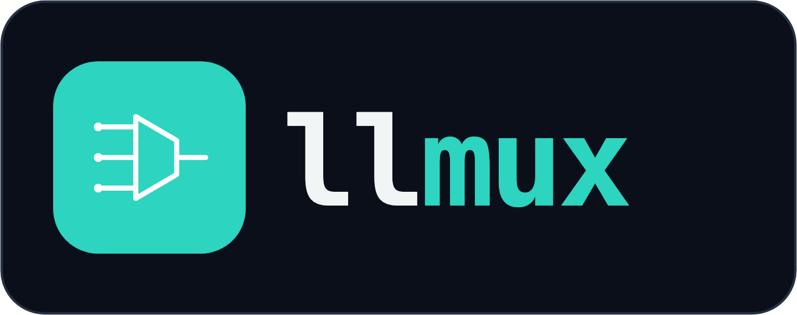
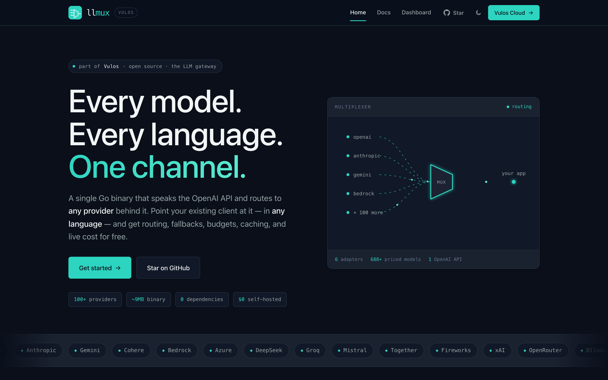
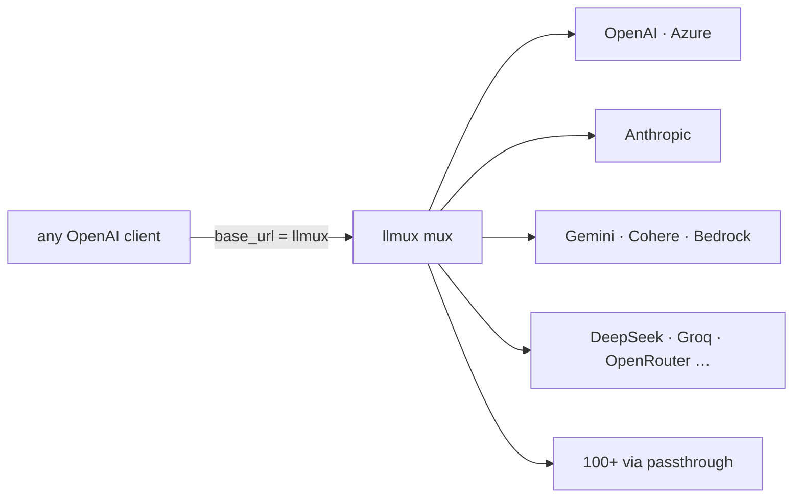
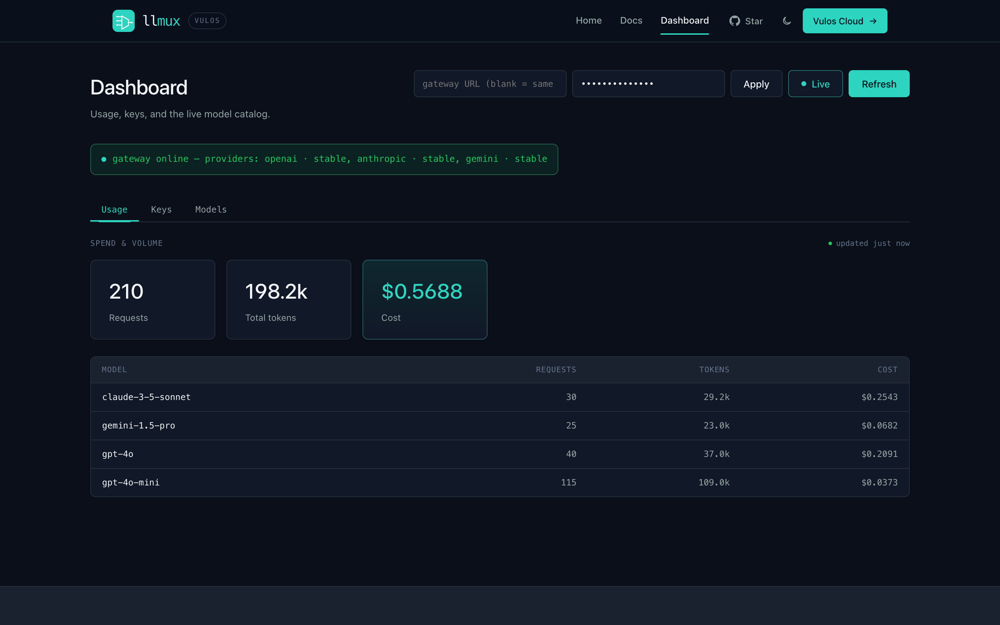
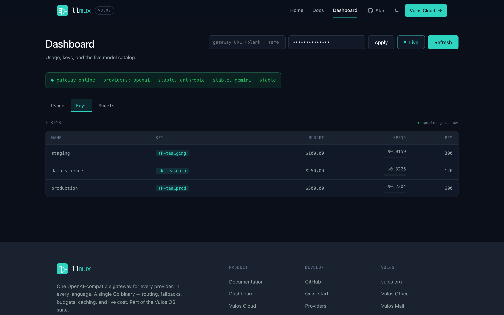
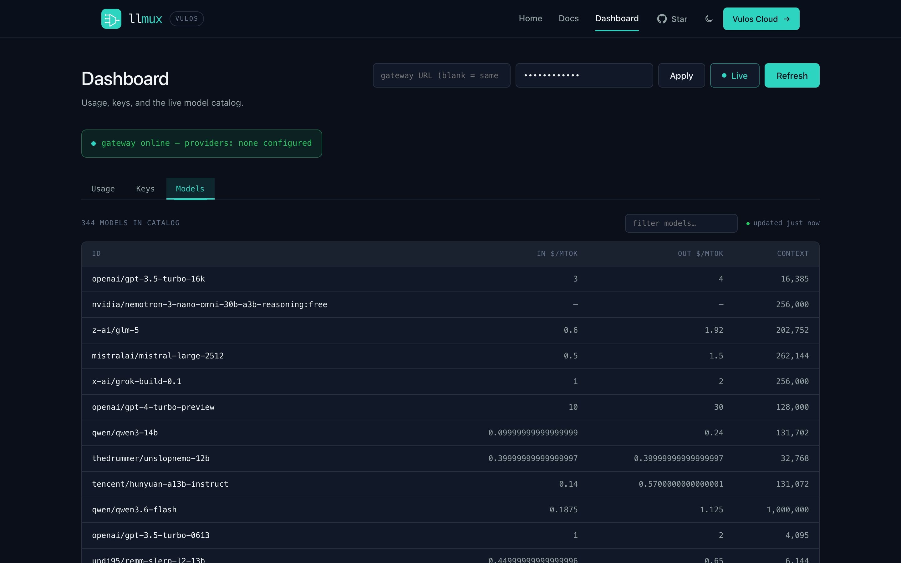
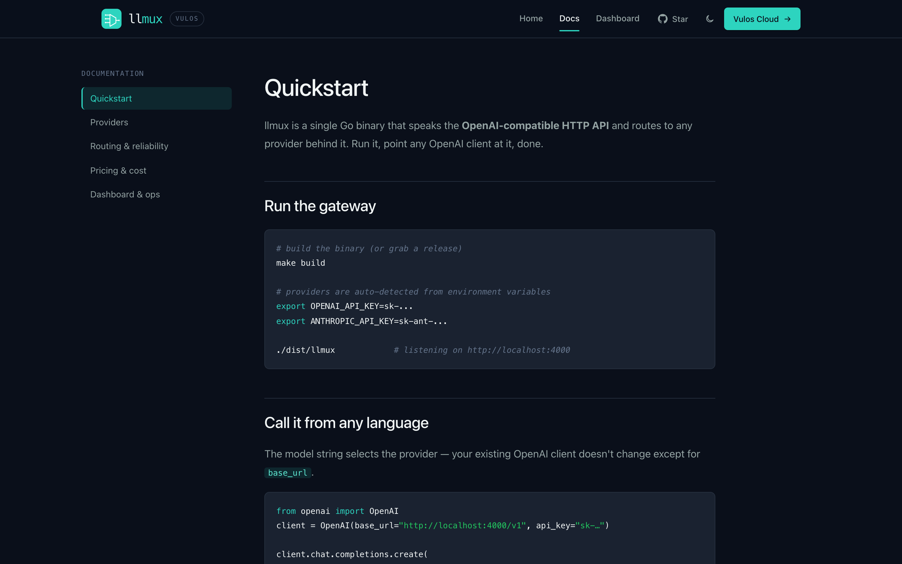

<div align="center">



### The sovereign OpenAI-compatible endpoint — your AI runs on your box.

Point your existing OpenAI SDK at llmux and get routing, fallbacks, per-key
budgets, caching, and live cost — across every provider, with zero per-language
code. Inference runs **on your box by default**, and a request is **never
silently sent off the box** unless you explicitly, loggably opt in.

[](LICENSE)
[](https://golang.org)
[](https://react.dev)
[](TESTING.md)

[**Quickstart**](web/docs/quickstart.md) · [**Docs**](docs/) · [**API**](docs/api.md) · [**Configuration**](docs/configuration.md) · [**Architecture**](docs/architecture.md)

<br/>



</div>

---

## What is llmux?

llmux is a **single Go binary** that speaks the OpenAI HTTP API and routes every
request to the provider behind it — OpenAI, Anthropic, Azure, Bedrock, Cohere,
Gemini, or any OpenAI-shaped upstream via passthrough.

Every language already ships a mature OpenAI client that accepts a custom
`base_url`. Point it at llmux and the routing, budgets, caching, and cost
accounting happen underneath — no new SDK to learn.

It's **self-hosted, open source, has no telemetry**, and ships its admin
dashboard *inside* the binary. An optional control-plane seam adds centralized
billing when you want it, and is invisible when you don't.

It is also the **sovereign LLM gateway for Vulos**: a default-deny *sovereignty
gate* runs before every dispatch, so inference stays on your box unless you
explicitly opt a remote provider in. See
**[the sovereignty gate](docs/architecture.md#the-sovereignty-gate-where-your-ai-runs)**.



## Quick start

> **Prerequisites:** Go 1.25+, Node 18+ (only to rebuild the web UI), and at
> least one provider API key.

```bash
# 1. Build the binary (embeds the prebuilt web UI)
make build

# 2. Configure providers
export OPENAI_API_KEY=...
export ANTHROPIC_API_KEY=...

# 3. Run — gateway on :4000, dashboard at /ui
cp llmux.example.json llmux.json
./dist/llmux -config llmux.json
```

Then point any OpenAI client at it — the model string selects the route:

```python
from openai import OpenAI

client = OpenAI(base_url="http://localhost:4000/v1", api_key="sk-team-a")

resp = client.chat.completions.create(
    model="cheapest",                       # least-cost route from your config
    messages=[{"role": "user", "content": "hi"}],
)
print(resp.usage)                           # includes per-request cost
```

> **17+ languages** — copy-paste examples for Python, Node, TypeScript, Go, Ruby,
> PHP, Java, C#, Rust, C++, C, Swift, Kotlin, Elixir, R, and Dart live in the
> [Quickstart](web/docs/quickstart.md) (and at `/ui/docs` in the running gateway).

## Features

| | |
|---|---|
| 🛡️ **Sovereignty gate** | Inference runs **on your box by default**. A default-deny gate runs before *every* dispatch path — no request leaves the box for a remote provider unless you set `allow_egress` (or declare a `sovereign`/`brokered` tier) on that provider. Fails closed; every permitted off-box call is logged with its tier. |
| 🔌 **OpenAI-compatible API** | `chat/completions`, `completions`, `embeddings`, `models`, plus `responses`, `rerank`, `moderations`, `images/generations`, `audio/speech`, and `audio/transcriptions`+`audio/translations` (multipart speech-to-text — powers Meet captions). Works with any OpenAI SDK unchanged. (The extra modality routes — `responses`/`rerank`/`moderations`/`images`/`audio` — are proxied only to **passthrough** providers; a translating native adapter such as Anthropic/Gemini/Cohere/Bedrock returns 501 for them.) |
| 🌐 **Multi-provider routing** | Native adapters for Anthropic, Gemini, Cohere, Bedrock, and Azure — plus passthrough for any OpenAI-shaped upstream. Tool-calling, vision, and streaming translated per provider. |
| 🧭 **Flexible routes** | Model aliases, `provider/model` prefixes, wildcards (`claude-*`), catch-all routes, fallback chains with retries/backoff, and least-cost selection. |
| 📡 **Byte-identical SSE** | Streamed responses match OpenAI's wire format exactly, so every language's stream parser just works. |
| ⚡ **Caching** | Exact-match (LRU + TTL) and semantic (embedding-similarity), in-memory or shared via Redis. Scoped per virtual key. |
| 🔑 **Virtual keys & budgets** | Per-key USD budgets, RPM limits, and model allow-lists. Spend in Postgres, rate limits in Redis. |
| 💲 **Live pricing** | A built-in seed (cost works offline) auto-syncs from OpenRouter + LiteLLM. Cost appears in each response's `usage`; merged catalog at `GET /v1/catalog.json`. |
| 📊 **Embedded dashboard** | Usage by model, key budgets, and the live catalog — served from the binary at `/ui` via `go:embed`. No separate service. |
| 🛡️ **Hardened by default** | Constant-time auth, size/body limits, upstream timeouts, error normalization, `drop_params`, Prometheus `/metrics`, structured logs, `/health`. |

## Documentation

Full documentation lives in **[`docs/`](docs/)** (and inside the binary at `/ui/docs`).

| | |
|---|---|
| [Quickstart](web/docs/quickstart.md) | Run it and make your first request |
| [API reference](docs/api.md) | Endpoints, auth, errors, and cost |
| [Configuration](docs/configuration.md) | Config file + environment variables |
| [Routing & reliability](web/docs/routing.md) | Aliases, fallbacks, least-cost |
| [Providers](web/docs/providers.md) | Native adapters vs. passthrough |
| [Pricing & cost](web/docs/pricing.md) | The live catalog and cost accounting |
| [Architecture](docs/architecture.md) | How the gateway is laid out |
| [Control-plane seam](docs/control-plane.md) | Optional centralized billing |
| [Operations](docs/operations.md) | Build, test, and self-host |

## Dashboard

The admin dashboard ships *inside* the binary at `/ui` — no separate service, no extra deploy.

<details>
<summary><b>Screenshots</b> — usage, keys, catalog, docs</summary>

<br/>

<table>
  <tr>
    <td width="50%"></td>
    <td width="50%"></td>
  </tr>
  <tr>
    <td align="center"><sub><b>Usage</b> — requests, tokens, and cost, per model</sub></td>
    <td align="center"><sub><b>Keys</b> — per-key budgets, spend, and RPM</sub></td>
  </tr>
  <tr>
    <td width="50%"></td>
    <td width="50%"></td>
  </tr>
  <tr>
    <td align="center"><sub><b>Models</b> — the live, merged price catalog</sub></td>
    <td align="center"><sub><b>Docs</b> — quickstart, served from the binary</sub></td>
  </tr>
</table>

</details>

## Deployment modes

llmux is one self-hosted binary; its shape is defined by whether the optional
**control-plane seam** is wired. This lines up with the wider Vulos
[three-shape model](https://github.com/vul-os/vulos/blob/dev/docs/ARCHITECTURE.md#deployment-modes)
(self-host / OS-managed / cloud):

| Shape | How | Billing / sovereignty |
|---|---|---|
| **Self-hosted** (default) | Run the binary with provider keys and no `LLMUX_CP_URL` | No telemetry, no central billing — fully sovereign; inference stays on-box until you opt a remote provider in |
| **Control-plane-linked** | Set `LLMUX_CP_URL` / `LLMUX_CP_SECRET` | Virtual-key spend + usage metered through a central control plane (e.g. Vulos Cloud); the seam is invisible when unset |
| **Embedded in Vulos OS** | The OS points at it with `LLMUX_URL` | The same binary run on-box as the OS's sovereign LLM gateway — every product's AI features route through it |

The self-hosted and control-plane-linked shapes are the **same binary**; the CP
seam only *adds* central billing on top. See [control-plane.md](docs/control-plane.md).

## Self-hosting

A single binary with no required runtime dependencies — drop it on a host (or use
the [`Dockerfile`](Dockerfile)), point it at a config, and set your provider keys.
Add Postgres and Redis when you scale to multiple replicas. See
[Operations](docs/operations.md) and [HARDENING.md](HARDENING.md).

## Contributing & support

Issues and PRs welcome. See [SUPPORT.md](SUPPORT.md) for help and the
[roadmap](roadmap.md) for what's planned.

## Security

Please report vulnerabilities **privately** — see [SECURITY.md](SECURITY.md). Do
not file public issues for security problems.

## License

[MIT](LICENSE) — free to use, modify, and distribute.
