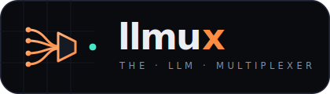
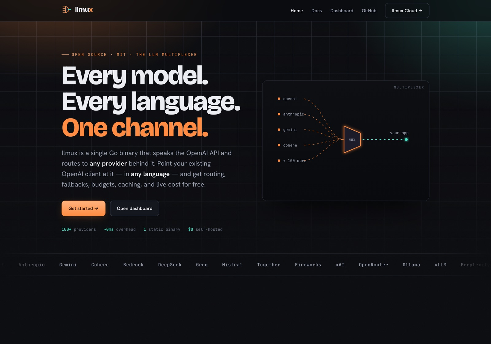
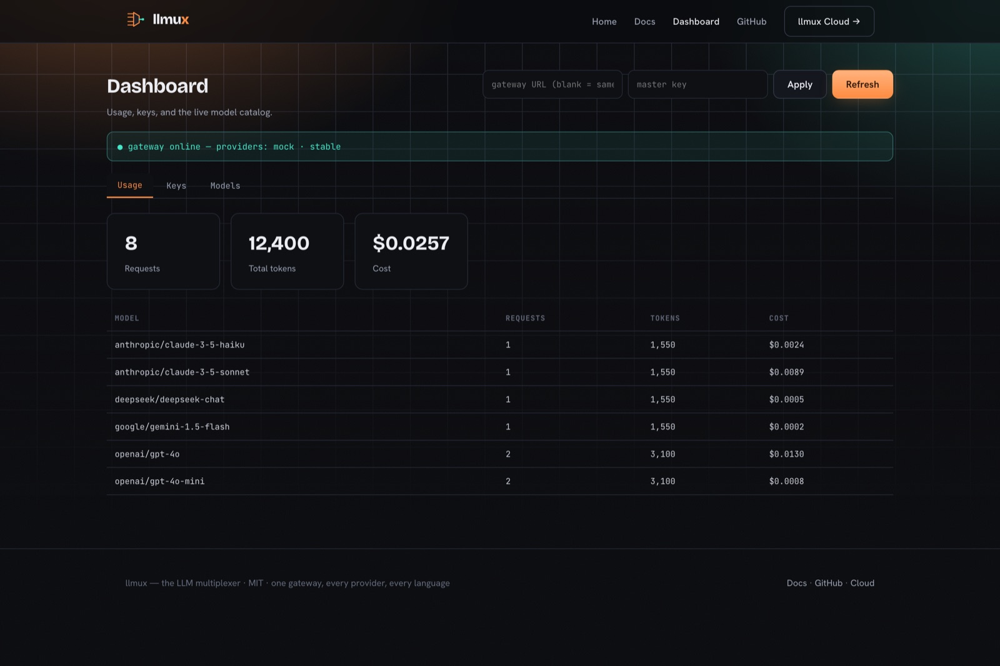
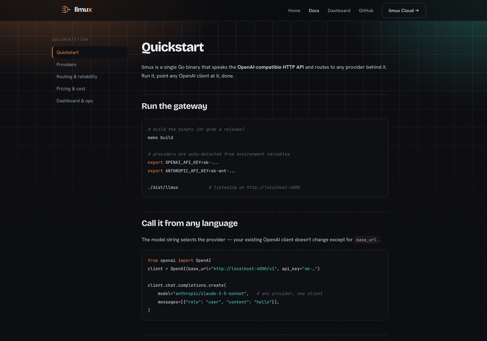

<p align="center">
  
</p>

<p align="center">
  <b>The LLM multiplexer.</b> One OpenAI-compatible gateway for <b>every provider</b>, in <b>every language</b>.
</p>

<p align="center">
  <a href="#quick-start">Quickstart</a> ·
  <a href="SUPPORT.md">Providers</a> ·
  <a href="PARITY.md">Parity</a> ·
  <a href="https://llmux.to">Cloud</a> ·
  MIT
</p>

<p align="center">
  
</p>

llmux is a single Go binary that speaks the **OpenAI-compatible HTTP API** and
routes to any LLM provider behind it. Because every language already ships a
mature OpenAI client that accepts a custom `base_url`, llmux works in **every
language on day one with zero per-language code** — point your existing OpenAI
SDK at llmux and get routing, fallbacks, budgets, caching, and live cost
tracking underneath.

```
  any-language app ──(OpenAI SDK, base_url=llmux)──▶ llmux ──▶ OpenAI
                                                          ├──▶ Anthropic
                                                          ├──▶ Gemini
                                                          ├──▶ DeepSeek / Groq / xAI / OpenRouter / Ollama …
                                                          └──▶ 100+ via passthrough
```

> Open source (MIT), self-host free forever · home: [llmux.to](https://llmux.to)

### Built-in dashboard & live docs

A web dashboard + docs ship **inside the binary** at `/ui` (no extra service):

<p align="center">
  
  
</p>

---

## Why this design

LiteLLM is **library-first** (a Python SDK), which structurally traps it in
Python. llmux is **gateway-first**: the OpenAI HTTP schema is the canonical
interface, providers are adapters behind it, and the language ecosystems already
wrote the clients. We write the gateway once; you get every language free.

Three rules keep "any language" true as features grow:
1. The OpenAI HTTP schema is the canonical interface — provider quirks never leak.
2. Routing / fallback / budget controls ride on standard fields + `extra_headers`
   / `metadata`, so no custom client is ever needed.
3. Streaming is **byte-identical** to OpenAI SSE, so every language's stream
   parser just works.

---

## Quick start

### Run the gateway

```bash
make build
export OPENAI_API_KEY=...        # providers auto-detected from env
export ANTHROPIC_API_KEY=...
./dist/llmux                      # listens on :4000
# or: ./dist/llmux -config llmux.example.json
```

Now point **any** OpenAI client at it:

```python
from openai import OpenAI
client = OpenAI(base_url="http://localhost:4000/v1", api_key="x")
client.chat.completions.create(
    model="claude-3-5-sonnet",            # any provider, one client
    messages=[{"role": "user", "content": "hi"}],
)
```

### Or embed it locally — no server to run

Each language package bundles the binary and starts it for you as a local
sidecar (Go runs it in-process). This is the local wedge: integrate in any
language without standing up a server.

**Python**
```python
import llmux
client = llmux.OpenAI()                    # spawns the gateway, returns an OpenAI client
client.chat.completions.create(model="gemini-1.5-pro", messages=[...])
```

**Node**
```js
const llmux = require("llmux");
const client = await llmux.OpenAI();
await client.chat.completions.create({ model: "gpt-4o", messages: [...] });
```

**Go** (in-process, no subprocess)
```go
local, _ := llmux.Start(llmux.Options{})
defer local.Close()
// point any OpenAI Go client at local.OpenAIBaseURL()
```

See [`sdks/`](sdks/) for details.

### Web dashboard

Open **`http://localhost:4000/ui`** — a Vite + React app (landing, docs, and an
admin/usage dashboard for keys, spend, usage-by-model, and the model catalog).
It's built once and **embedded into the gateway binary** (`go:embed`), so
self-hosters get it with zero extra setup. The same app is the basis for the
`llmux.to` site. Rebuild it with `make web`. (Mirrors how LiteLLM ships its React
admin UI inside the OSS proxy; SSO/RBAC/audit are reserved for `ee/`.)

---

## Features

| Area | What |
|------|------|
| **Any language** | OpenAI-compatible REST + SSE; works with every OpenAI SDK unchanged |
| **Providers** | Passthrough (OpenAI, DeepSeek, Groq, Mistral, Together, Fireworks, xAI, OpenRouter, Ollama/vLLM) + adapters (Anthropic, Gemini, Cohere, AWS Bedrock) with full tool-calling, vision, and streaming translation |
| **Embeddings** | `/v1/embeddings` via passthrough, Gemini, and Cohere |
| **Routing** | Aliases, `provider/model` prefix, catch-all, fallback chains, **least-cost** selection |
| **Reliability** | Automatic retries with backoff; provider failover |
| **Cost** | Live price catalog (auto-synced from OpenRouter + LiteLLM's open JSON); cost in every response `usage` block; `/v1/models` from the catalog |
| **Governance** | Virtual keys with per-key budgets, rate limits, and model allow-lists |
| **Performance** | Exact-match response cache (LRU + TTL) |
| **Ops** | Prometheus `/metrics`, structured access logs + `X-Request-ID`, JSONL usage log, admin endpoints (`/admin/keys`, `/admin/usage`), persistent spend (`key_store_path`), health check, single static binary, Docker |
| **CLI** | `llmux serve\|version\|models\|catalog\|keys` |
| **Web dashboard** | Vite + React app (landing, docs, admin/usage) **embedded in the binary**, served at `/ui` — no separate Node server at runtime |

---

## API

- `POST /v1/chat/completions` — chat (streaming + non-streaming)
- `POST /v1/embeddings` — embeddings
- `POST /v1/completions` · `/v1/moderations` · `/v1/images/generations` · `/v1/audio/speech` · `/v1/rerank` · `/v1/responses` — modality routes (forwarded to OpenAI-compatible providers)
- `GET  /v1/models` — catalog-backed model list with pricing + capabilities
- `GET  /health` — health + provider list
- `GET  /metrics` — Prometheus metrics

Model selection:
- a configured route/alias (`"claude-3-5-sonnet"`)
- `provider/model` prefix (`"anthropic/claude-3-5-sonnet"`)
- a strategy alias (e.g. `"cheapest"` → least-cost across candidates)

---

## Configuration

Zero-config: with provider env vars set, llmux auto-detects providers and routes
by `provider/model` prefix. For routing, fallbacks, budgets, and caching, pass a
JSON config — see [`llmux.example.json`](llmux.example.json).

Key env vars: `LLMUX_ADDR`, `LLMUX_SOCKET`, `LLMUX_CONFIG`, `LLMUX_MASTER_KEY`,
`LLMUX_USAGE_LOG`, plus the provider keys (`OPENAI_API_KEY`, `ANTHROPIC_API_KEY`,
`GEMINI_API_KEY`, …).

---

## Pricing catalog — free, more live than LiteLLM, and route-correct

A small catalog ships built-in so cost works offline. At runtime llmux auto-syncs
from pluggable **sources** and merges them by **precedence** so cost is correct
per route:

```
override (manual pin)  >  provider pricing API (Azure/…)  >  LiteLLM (direct)  >  OpenRouter (margin)  >  built-in seed
```

- **Route-aware:** a call routed *through* OpenRouter is costed at OpenRouter's
  (margin-inclusive) price; a **direct** BYO-key call prefers the authoritative
  direct price — so you're never over-charged on direct routes.
- **Manual overrides** (inline or a JSON file, hot-reloaded) always win — pin
  prices for private models or correct a stale feed in one line.
- **Disk cache** (`catalog_path`) gives instant warm starts and offline survival.
- **Open export:** `GET /v1/catalog.json` republishes the merged catalog so others
  can consume it — fresher than a PR-gated file.

Cost appears in every response's `usage.cost` block and is charged against the
calling key's budget. Adding a source is one `Source` implementation
(`Name`/`Priority`/`Fetch`).

---

## Architecture

```
core/                MIT/Apache — the open gateway
  openai/            canonical wire types (the contract)
  config/            config loader (env + JSON)
  server/            HTTP gateway, streaming, auth, metrics, usage
  provider/          Provider interface + SSE utils
    passthrough/     OpenAI-shaped upstreams
    anthropic/       Anthropic Messages adapter
    gemini/          Gemini generateContent adapter
  providers/         adapter wiring
  router/            routing + least-cost
  keys/              virtual keys, budgets, rate limits
  cache/             exact-match response cache
  pricing/           catalog + live sync + cost
cmd/llmux/           the binary (server + local sidecar)
sdks/                thin language packages (python, node, go)
ee/                  enterprise/cloud (open-core)
```

The **same binary** is both the hosted server and the locally-embedded sidecar —
one codebase, two distribution modes.

---

## Development

```bash
make build      # build the binary
make test       # run all Go tests
make sdk-bins   # build the binary into each language package for local dev
make docker     # build the Docker image
```

## License

**MIT** — see [LICENSE](LICENSE). The whole project is open source under MIT;
monetization is the hosted **llmux Cloud**, not a different code license. See
[ee/README.md](ee/README.md) for the Cloud/enterprise direction.
