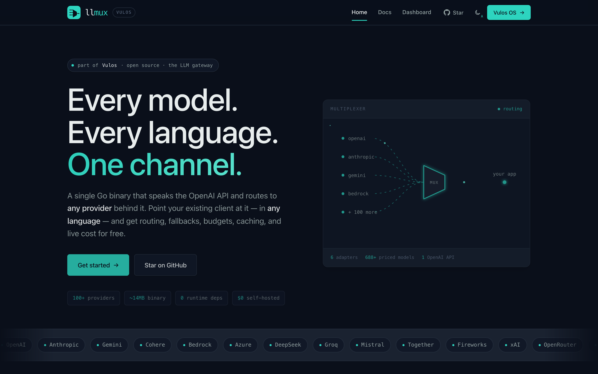
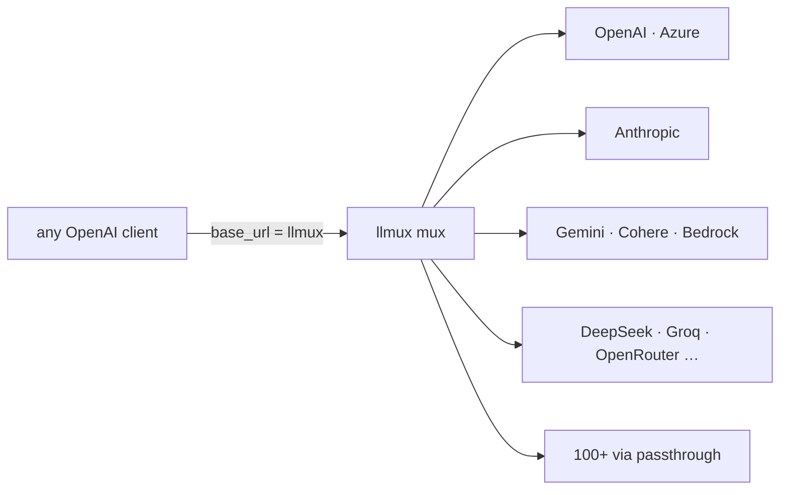
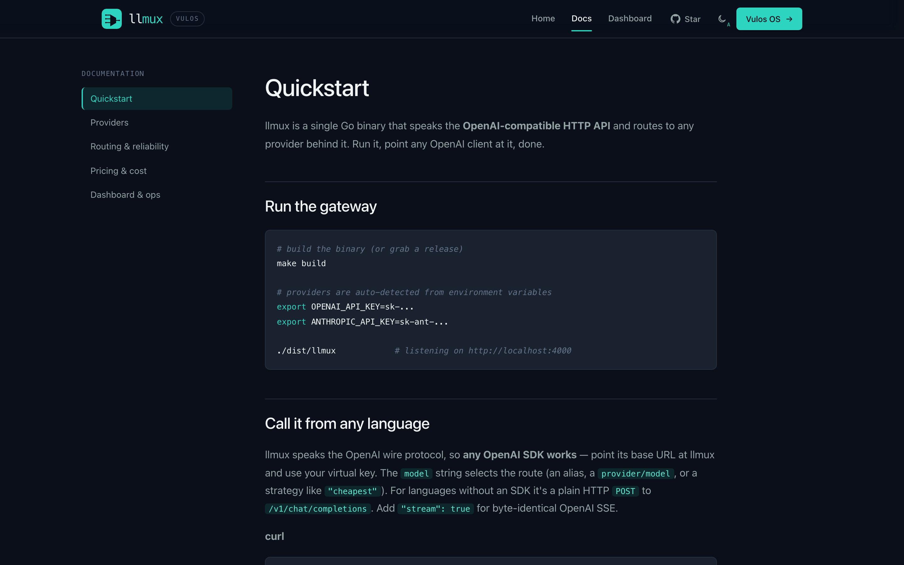

<div align="center">


### The sovereign OpenAI-compatible endpoint — your AI runs on your box.

Point your existing OpenAI SDK at llmux and get routing, fallbacks, per-key
budgets, caching, and live cost — across every provider, with zero per-language
code. Inference runs **on your box by default**, and a request is **never
silently sent off the box** unless you explicitly, loggably opt in.

[](LICENSE-MIT)
[](https://golang.org)
[](https://react.dev)
[](TESTING.md)

[**Quickstart**](web/docs/quickstart.md) · [**Docs**](docs/) · [**API**](docs/api.md) · [**Configuration**](docs/configuration.md) · [**Architecture**](docs/architecture.md)

<br/>



</div>

---

## What is llmux?

llmux is a **single Go binary** that speaks the OpenAI HTTP API and routes every
request to the provider behind it — OpenAI, Anthropic, Azure, Bedrock, Cohere,
Gemini, or any OpenAI-shaped upstream via passthrough.

Every language already ships a mature OpenAI client that accepts a custom
`base_url`. Point it at llmux and the routing, budgets, caching, and cost
accounting happen underneath — no new SDK to learn.

It's **self-hosted, open source, has no telemetry, and has no accounts** — no
login, no email, no sign-up; you authenticate with an operator-issued bearer
token and configure it by endpoint. It ships its admin dashboard *inside* the
binary. An optional control-plane seam adds centralized billing when you want
it, and is invisible when you don't.

It also enforces a default-deny *sovereignty gate* before every dispatch, so
inference stays on your box unless you explicitly opt a remote provider in. See
**[the sovereignty gate](docs/architecture.md#the-sovereignty-gate-where-your-ai-runs)**
— including [what it does not cover](docs/architecture.md#what-the-gate-does-not-cover),
which is stated plainly rather than left to be discovered.

> ### ⚠️ One outbound call IS on by default: the price-catalog sync
>
> llmux is this suite's reference implementation of default-deny egress, so the
> single exception is stated up front rather than buried in a feature table.
>
> `config.Default()` ships two public price feeds — `openrouter.ai` and
> `raw.githubusercontent.com` — so **a stock gateway makes an outbound GET at
> startup and every `sync_interval_minutes` (default 360) without you
> configuring anything.** It is a plain GET of a public price list: it carries
> **no prompt, no completion, no API key, and no usage data**, and it is *not*
> covered by the sovereignty gate, which governs inference dispatch only.
>
> If "no network calls unless I ask" is a requirement for you, turn it off:
>
> ```json
> { "pricing": { "sources": [] } }
> ```
>
> Cost accounting still works offline from the built-in seed catalog; you can
> also point `sources` at your own mirror. This default has **not** been
> changed — it is disclosed so the choice is yours and informed. Full detail:
> [what the gate does not cover](docs/architecture.md#what-the-gate-does-not-cover)
> and the `outboundDialSites` census in `core/sovereign/egress_guard_test.go`.


```mermaid
flowchart LR
    client["any OpenAI client"] -->|"base_url = llmux"| mux["llmux mux"]
    mux --> p1["OpenAI · Azure"]
    mux --> p2["Anthropic"]
    mux --> p3["Gemini · Cohere · Bedrock"]
    mux --> p4["DeepSeek · Groq · OpenRouter …"]
    mux --> p5["100+ via passthrough"]
```

## Quick start

> **Prerequisites:** Go 1.25+, and at least one provider API key. Node is only
> needed to *rebuild* the web UI (the built bundle is committed and embedded) —
> and when you do, it must be **Node 20.19+ or 22.12+**, which is what `web/`'s
> vite 8 toolchain requires and what CI uses.

```bash
# 1. Build the binary (embeds the prebuilt web UI)
make build

# 2. Configure providers
export OPENAI_API_KEY=...
export ANTHROPIC_API_KEY=...

# 3. Run — gateway on :4000, dashboard at /ui
cp llmux.example.json llmux.json
./dist/llmux -config llmux.json
```

Then point any OpenAI client at it — the model string selects the route:

```python
from openai import OpenAI

client = OpenAI(base_url="http://localhost:4000/v1", api_key="sk-team-a")

resp = client.chat.completions.create(
    model="cheapest",                       # least-cost route from your config
    messages=[{"role": "user", "content": "hi"}],
)
print(resp.usage)                           # includes per-request cost
```

> **17+ languages** — copy-paste examples for Python, Node, TypeScript, Go, Ruby,
> PHP, Java, C#, Rust, C++, C, Swift, Kotlin, Elixir, R, and Dart live in the
> [Quickstart](web/docs/quickstart.md) (and at `/ui/docs` in the running gateway).

### Verify a release before you run it

Prefer the prebuilt archives? Every release publishes a `SHA256SUMS` manifest
covering **all** of its assets, plus a sigstore build-provenance attestation
minted from the release workflow's OIDC identity (there is no long-lived signing
key, so there is none to leak or rotate). `scripts/verify.sh` is what you run
before executing the bytes:

```bash
curl -fsSLO https://raw.githubusercontent.com/vul-os/llmux/v0.2.0/scripts/verify.sh
bash verify.sh --tag v0.2.0 --attest llmux_0.2.0_linux_amd64.zip
```

It fetches the manifest, looks up the **exact** entry for that asset (names are
compared as strings, not as regexes) and compares digests. Two outcomes only:
verified, or non-zero with a diagnostic naming what was wrong — missing or
malformed manifest, no entry for the asset, truncated download, digest mismatch,
HTML error page served where bytes were expected. There is no `--skip-verify`,
and a `SHA256SUMS` that 404s is a **failure**, never "nothing to check".
`--attest` additionally verifies the provenance (needs the `gh` CLI); leave it
off and the script says out loud that provenance was *not* checked, so a pass
never implies more than it checked.

`make verify-selftest` runs 24 synthetic-origin cases asserting that each
refusal still fires; CI runs the same matrix on every push.

## Features

| | |
|---|---|
| 🛡️ **Sovereignty gate** | Inference runs **on your box by default**. A default-deny gate runs before *every* dispatch path — no request leaves the box for a remote provider unless you set `allow_egress` (or declare a `sovereign`/`brokered` tier) on that provider. Fails closed; every permitted off-box call is logged with its tier. |
| 🔌 **OpenAI-compatible API** | `chat/completions`, `completions`, `embeddings`, `models`, plus `responses`, `rerank`, `moderations`, `images/generations`, `audio/speech`, and `audio/transcriptions`+`audio/translations` (multipart speech-to-text — e.g. voice captions / transcription). Works with any OpenAI SDK unchanged. (The extra modality routes — `responses`/`rerank`/`moderations`/`images`/`audio` — are proxied only to **passthrough** providers; a translating native adapter such as Anthropic/Gemini/Cohere/Bedrock returns 501 for them.) |
| 🌐 **Multi-provider routing** | Native adapters for Anthropic, Gemini, Cohere, Bedrock, and Azure — plus passthrough for any OpenAI-shaped upstream. Tool-calling, vision, and streaming translated per provider. |
| 🧭 **Flexible routes** | Model aliases, `provider/model` prefixes, wildcards (`claude-*`), catch-all routes, fallback chains with retries/backoff, and least-cost selection. |
| 📡 **Byte-identical SSE** | Streamed responses match OpenAI's wire format exactly, so every language's stream parser just works. |
| ⚡ **Caching** | Exact-match (LRU + TTL) and semantic (embedding-similarity), in-memory or shared via Redis. Scoped per virtual key. |
| 🔑 **Virtual keys & budgets** | Per-key USD budgets, RPM limits, and model allow-lists. Spend in Postgres, rate limits in Redis. |
| 💲 **Live pricing** | A built-in seed (cost works offline) auto-syncs from OpenRouter + LiteLLM. Cost appears in each response's `usage`; merged catalog at `GET /v1/catalog.json`. **This sync is the one outbound call a stock gateway makes on its own** — a plain GET of a public price list, carrying no prompt, key, or usage, and *not* covered by the sovereignty gate (which governs inference). Turn it off with `"pricing": {"sources": []}`, or point it at your own mirror. |
| 📊 **Embedded dashboard** | Usage by model, key budgets, and the live catalog — served from the binary at `/ui` via `go:embed`. No separate service. |
| 🛡️ **Hardened by default** | Constant-time auth, size/body limits, upstream timeouts, error normalization, `drop_params`, Prometheus `/metrics`, structured logs, `/health`. |

## Documentation

Full documentation lives in **[`docs/`](docs/)** (and inside the binary at `/ui/docs`).

| | |
|---|---|
| [Quickstart](web/docs/quickstart.md) | Run it and make your first request |
| [API reference](docs/api.md) | Endpoints, auth, errors, and cost |
| [Configuration](docs/configuration.md) | Config file + environment variables |
| [Routing & reliability](web/docs/routing.md) | Aliases, fallbacks, least-cost |
| [Providers](web/docs/providers.md) | Native adapters vs. passthrough |
| [Pricing & cost](web/docs/pricing.md) | The live catalog and cost accounting |
| [Architecture](docs/architecture.md) | How the gateway is laid out |
| [Control-plane seam](docs/control-plane.md) | Optional centralized billing |
| [Operations](docs/operations.md) | Build, test, and self-host |

## Dashboard

The admin dashboard ships *inside* the binary at `/ui` — no separate service, no extra deploy.

<details>
<summary><b>Screenshots</b> — usage, keys, catalog, docs</summary>

<br/>

<table>
  <tr>
    <td width="50%"></td>
    <td width="50%"></td>
  </tr>
  <tr>
    <td align="center"><sub><b>Usage</b> — requests, tokens, and cost, per model</sub></td>
    <td align="center"><sub><b>Keys</b> — per-key budgets, spend, and RPM</sub></td>
  </tr>
  <tr>
    <td width="50%"></td>
    <td width="50%"></td>
  </tr>
  <tr>
    <td align="center"><sub><b>Models</b> — the live, merged price catalog</sub></td>
    <td align="center"><sub><b>Docs</b> — quickstart, served from the binary</sub></td>
  </tr>
</table>

</details>

## Deployment modes

llmux is one self-hosted binary; its shape is defined by whether the optional
**control-plane seam** is wired:

| Shape | How | Billing / sovereignty |
|---|---|---|
| **Self-hosted** (default) | Run the binary with provider keys and no `LLMUX_CP_URL` | No telemetry, no central billing — fully sovereign; inference stays on-box until you opt a remote provider in |
| **Control-plane-linked** | Set `LLMUX_CP_URL` / `LLMUX_CP_SECRET` | Virtual-key spend + usage metered through a central control plane; the seam is invisible when unset |

Both shapes are the **same binary**; the CP seam only *adds* central billing on
top. See [control-plane.md](docs/control-plane.md).

## Self-hosting

A single binary with no required runtime dependencies — drop it on a host (or use
the [`Dockerfile`](Dockerfile)), point it at a config, and set your provider keys.
Add Postgres and Redis when you scale to multiple replicas. See
[Operations](docs/operations.md) and [HARDENING.md](HARDENING.md).

## Contributing & support

Issues and PRs welcome. See [SUPPORT.md](SUPPORT.md) for help, the
[roadmap](ROADMAP.md) for what's planned, and the [changelog](CHANGELOG.md)
for what's shipped.

## Security

Please report vulnerabilities **privately** — see [SECURITY.md](SECURITY.md). Do
not file public issues for security problems.

## License

[MIT](LICENSE-MIT) OR [Apache-2.0](LICENSE-APACHE) — © VulOS. llmux is a VulOS
project; source and issues at [github.com/vul-os/llmux](https://github.com/vul-os/llmux).

---

<p align="center">
  <a href="https://vulos.org"></a><br>
  <sub><a href="https://vulos.org"><b>vulos</b></a> — open by design</sub>
</p>
