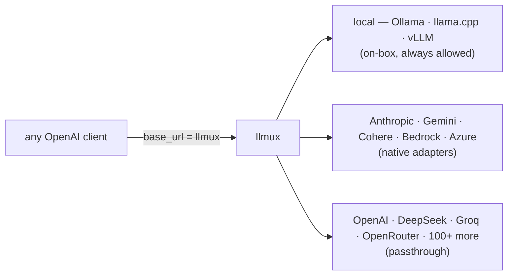
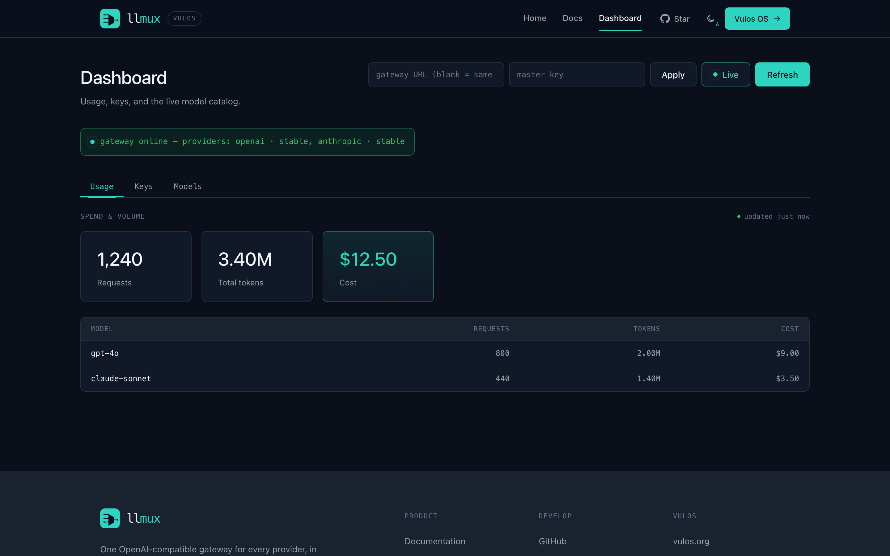

<div align="center">


### Import it. The server is optional. Your AI runs on your box either way.

`go get github.com/vul-os/llmux/core/gateway` gets you the whole dispatch
path — routing, fallbacks, per-key budgets, caching, live cost, and a
default-deny sovereignty gate — as an in-process Go library with **no HTTP
surface, no port, and nothing started until you ask for it**. Want a
standalone service instead (or as well)? The same code ships as a single
binary with an OpenAI-compatible HTTP API and an embedded admin dashboard.
Not writing Go? **[Fifteen language packages](#fifteen-languages-two-ways)**
reach the same gateway two ways — in-process through a six-function C ABI, or
as a sidecar they spawn and supervise for you.

**[MIT OR Apache-2.0](LICENSE-MIT) · Go 1.25 · [Tests](TESTING.md)**

[**Quickstart**](#quick-start) · [**Fifteen languages**](#fifteen-languages-two-ways) · [**Docs**](docs/) · [**API**](docs/api.md) · [**Configuration**](docs/configuration.md) · [**Sovereignty gate**](#the-sovereignty-gate) · [**Status**](#status)

</div>

---

## What is llmux?

llmux is a Go **library first**: `core/gateway` is the whole dispatch
path — routing, retries, failover, sovereignty enforcement, BYOK, caching,
pricing and metering — with no HTTP surface of its own. `import` it into a Go
program, call `gateway.New`, and dispatch with `Chat` / `ChatStream` / `Embed`;
nothing starts until you tell it to. Native adapters cover Anthropic, Gemini,
Cohere, Bedrock, and Azure; passthrough covers any OpenAI-shaped upstream
(OpenAI, DeepSeek, Groq, Mistral, Together, OpenRouter, and 100+ more); a
`local` provider covers an on-box Ollama/llama.cpp/vLLM server.

`core/server` is one shell over that library — the same code compiled as a
**single Go binary** that speaks the OpenAI HTTP API. It is not the only
possible shell, and `core/gateway` never imports it. Every language already
ships a mature OpenAI client that accepts a custom `base_url`; point one at the
binary and the routing, budgets, caching, and cost accounting happen
underneath — no new SDK to learn. See [Client examples → embed it
locally](docs/client-examples.md#embed-it-locally-no-separate-server-to-run)
for the Go library API, or the [quick start](#quick-start) below for the
binary. If you would rather not hold a `base_url` at all, the
[fifteen language packages](#fifteen-languages-two-ways) reach this same one
gateway without one.

It's **self-hosted, open source, has no telemetry, and has no accounts** — no
login, no email, no sign-up; the binary authenticates callers with an
operator-issued bearer token and is configured by editing a JSON file. It ships
an admin dashboard *inside* the binary — usage, keys, and the live model
catalog, nothing more — and that dashboard is itself optional: the `noui`
build tag drops it from the binary entirely, and `server.Options{UI: false}`
turns off the route at runtime (without shrinking the binary — only the build
tag does that). See [Operations → building without the
console](docs/operations.md#building-without-the-console-noui). An optional
control-plane seam adds centralized billing when you want it, and is invisible
when you don't.

It also enforces a default-deny *sovereignty gate* before every dispatch —
whether called from Go in-process or over HTTP — so inference stays on your box
unless you explicitly opt a provider in. This is the reason the project
exists — see **[the sovereignty gate](#the-sovereignty-gate)** below.

> ### ⚠️ One outbound call IS on by default: the price-catalog sync
>
> llmux is the reference implementation of default-deny egress elsewhere in
> this suite, so the single exception is stated up front rather than buried in
> a feature table.
>
> `config.Default()` ships two public price feeds — `openrouter.ai` and
> `raw.githubusercontent.com` — so **a stock gateway makes an outbound GET at
> startup and every `sync_interval_minutes` (default 360) without you
> configuring anything.** It is a plain GET of a public price list: it carries
> **no prompt, no completion, no API key, and no usage data**, and it is *not*
> covered by the sovereignty gate, which governs inference dispatch only.
>
> If "no network calls unless I ask" is a requirement for you, turn it off:
>
> ```json
> { "pricing": { "sources": [] } }
> ```
>
> Cost accounting still works offline from the built-in seed catalog; you can
> also point `sources` at your own mirror. This default has **not** been
> changed — it is disclosed so the choice is yours and informed. Full detail:
> [what the gate does not cover](docs/architecture.md#what-the-gate-does-not-cover)
> and the `outboundDialSites` census in `core/sovereign/egress_guard_test.go`.


```mermaid
flowchart LR
    client["any OpenAI client"] -->|"base_url = llmux"| mux["llmux"]
    mux --> local["local — Ollama · llama.cpp · vLLM<br/>(on-box, always allowed)"]
    mux --> native["Anthropic · Gemini · Cohere · Bedrock · Azure<br/>(native adapters)"]
    mux --> pass["OpenAI · DeepSeek · Groq · OpenRouter · 100+ more<br/>(passthrough)"]
```

## Quick start

### As a library

```bash
go get github.com/vul-os/llmux/core/gateway
```

```go
import (
    "github.com/vul-os/llmux/core/config"
    "github.com/vul-os/llmux/core/gateway"
    "github.com/vul-os/llmux/core/openai"
)

gw, err := gateway.New(config.Default())   // no goroutines started, no sockets opened*
if err != nil {
    log.Fatal(err)
}
defer gw.Close()

res, err := gw.Chat(ctx, &openai.ChatCompletionRequest{
    Model:    "cheapest",                                            // least-cost route from your config
    Messages: []openai.Message{{Role: "user", Content: openai.Str("hi")}},
})
fmt.Println(res.Response.Choices[0].Message.Content.String(), res.Response.Usage.Cost)
```

\* Two exceptions, stated up front: if `cfg.Postgres` is set, `New` connects and
migrates the key store **eagerly**; and `New` reads `os.Getenv` for any
provider configured with `api_key_env` (config-directed, not auto-detected —
see [Architecture → llmux as a library](docs/architecture.md#llmux-as-a-library)).
Everything else — the price-catalog sync, the spend flusher, a Redis ping — is
opt-in via `gw.Run(ctx)`.

Building your own auth layer on top? Route every call through
`gw.Authorize(ctx, token)` first — it returns `(ctx, release func(), error)`,
and `release` is **never nil** and **must always be called**, even on error, or
a budget-gate reservation leaks. Full API, streaming, and the deprecated
loopback-sidecar path: [Client examples → embed it
locally](docs/client-examples.md#embed-it-locally-no-separate-server-to-run).

### As a server (the sidecar)

The same code, compiled as a single binary with an OpenAI-compatible HTTP API
and the embedded admin console.

> **Prerequisites:** Go 1.25+, and at least one provider API key. There is no
> Node toolchain anywhere in this repo — the embedded admin console
> (`web/ui.html`) is one hand-written HTML file with inline CSS/JS, so
> `go build` alone is enough, including for UI changes.

```bash
git clone https://github.com/vul-os/llmux
cd llmux
make build      # builds ./dist/llmux with the web UI embedded
```

```bash
export OPENAI_API_KEY=...
export ANTHROPIC_API_KEY=...

cp llmux.example.json llmux.json
./dist/llmux -config llmux.json    # gateway on :4000, dashboard at /ui
```

Then point any OpenAI client at it — the model string selects the route:

```python
from openai import OpenAI

client = OpenAI(base_url="http://localhost:4000/v1", api_key="sk-team-a")

resp = client.chat.completions.create(
    model="cheapest",                       # least-cost route from your config
    messages=[{"role": "user", "content": "hi"}],
)
print(resp.usage)                           # carries a "cost" object alongside
                                             # the standard token counts
```

The `usage` block on every response is the standard OpenAI shape plus one
additive extension — a `cost` object computed from the live pricing catalog,
which any OpenAI client ignores harmlessly if it doesn't look for it:

```jsonc
{
  "usage": {
    "prompt_tokens": 9, "completion_tokens": 12, "total_tokens": 21,
    "cost": { "input_cost": 0.0000014, "output_cost": 0.0000072, "total_cost": 0.0000086, "currency": "USD" }
  }
}
```

Building without the console: `go build -tags noui` drops `web/ui.html` and its
license notices from the binary — 33,312 bytes smaller in this checkout. Full
breakdown: [Operations → building without the
console](docs/operations.md#building-without-the-console-noui).

> **17+ languages over plain HTTP** — copy-paste examples for Python, Node,
> TypeScript, Go, Ruby, PHP, Java, C#, Rust, C++, C, Swift, Kotlin, Elixir, R,
> and Dart live in [Client examples](docs/client-examples.md). If you would
> rather not run a server at all, **fifteen of those languages have a package
> that spawns one for you, or skips the process entirely** — see
> [fifteen languages, two ways](#fifteen-languages-two-ways).

### Verify a release before you run it

Prefer the prebuilt archives? Every release publishes a `SHA256SUMS` manifest
covering **all** of its assets, plus a sigstore build-provenance attestation
minted from the release workflow's OIDC identity (there is no long-lived signing
key, so there is none to leak or rotate). `scripts/verify.sh` is what you run
before executing the bytes:

```bash
curl -fsSLO https://raw.githubusercontent.com/vul-os/llmux/v0.1.5/scripts/verify.sh
bash verify.sh --tag v0.1.5 --attest llmux_0.1.5_linux_amd64.zip
```

It fetches the manifest, looks up the **exact** entry for that asset (names are
compared as strings, not as regexes) and compares digests. Two outcomes only:
verified, or non-zero with a diagnostic naming what was wrong — missing or
malformed manifest, no entry for the asset, truncated download, digest mismatch,
HTML error page served where bytes were expected. There is no `--skip-verify`,
and a `SHA256SUMS` that 404s is a **failure**, never "nothing to check".
`--attest` additionally verifies the provenance (needs the `gh` CLI); leave it
off and the script says out loud that provenance was *not* checked, so a pass
never implies more than it checked.

`make verify-selftest` runs 24 synthetic-origin cases asserting that each
refusal still fires; CI runs the same matrix on every push.

## Fifteen languages, two ways

llmux is not a Go-only library with an HTTP port bolted on. There are **fifteen
language packages** in [`sdks/`](sdks/), and each offers up to **two
mechanisms**:

- **Direct** — the gateway runs **inside your process**. No port, no listener,
  no loopback socket. Go imports the package; the other thirteen load a C shared
  library exposing exactly seven symbols — `llmux_new`, `llmux_call`,
  `llmux_stream`, `llmux_cancel`, `llmux_close`, `llmux_free`,
  `llmux_abi_version`. Requests and
  responses are the same JSON the HTTP API uses.
- **Sidecar** — the `llmux` binary as a child process the package spawns,
  health-checks and supervises for you on `127.0.0.1:<free port>`. You never run
  a server by hand, and streaming is your own language's HTTP/SSE client reading
  its own socket.

| Language | Package | Direct | Sidecar | Default |
|---|---|---|---|---|
| [Go](docs/sdks.md#go) | `go get github.com/vul-os/llmux/core/gateway` | package import — **no FFI at all** | ✓ | **direct** |
| [C](docs/sdks.md#c) | `#include "llmux.h"`, link `libllmux` | ✓ | ✓ | **direct** |
| [C++](docs/sdks.md#c-header-only) | header-only `llmux.hpp` | ✓ RAII | ✓ | **direct** |
| [Rust](docs/sdks.md#rust) | crate `llmux` | ✓ `libloading` | ✓ | direct |
| [Swift](docs/sdks.md#swift) | SwiftPM `LLMux` | ✓ C interop | ✓ | direct |
| [Deno](docs/sdks.md#deno) | `@vul-os/llmux` | ✓ `Deno.dlopen` | ✓ | direct |
| [Bun](docs/sdks.md#bun) | `@vul-os/llmux-bun` | ✓ `bun:ffi` | ✓ | direct |
| [Node.js](docs/sdks.md#nodejs) | npm `llmux` | ✓ koffi | ✓ | **sidecar** for servers |
| [Python](docs/sdks.md#python) | `pip install llmux` | ✓ `ctypes` | ✓ | **sidecar** |
| [Java](docs/sdks.md#java) | `to.llmux:llmux` | ✓ FFM, JDK 22+ | ✓ | **sidecar** |
| [Kotlin](docs/sdks.md#kotlin) | `to.llmux:llmux-kotlin` | ✓ over the Java binding | ✓ | **sidecar** |
| [.NET / C#](docs/sdks.md#net-and-c) | NuGet `Llmux` | ✓ `LibraryImport` | ✓ | **sidecar** |
| [Ruby](docs/sdks.md#ruby) | gem `llmux` | ✓ `fiddle` (stdlib) | ✓ | depends on your server |
| [PHP](docs/sdks.md#php) | composer `llmux/llmux` | ✓ ext-`FFI` | ✓ | **sidecar** |
| [Elixir](docs/sdks.md#elixir) | hex `:llmux` | **none, deliberately** | ✓ | **sidecar** |

Registry publication is uneven and this table will not pretend otherwise —
Python's is the only package README with a registry install line today, and
Kotlin's says its artifact is not yet published. **The path that works for all
fifteen right now is a checkout**: each `sdks/<lang>` is a working package
directory, and every language has a runnable example that boots a fake upstream,
so it works offline with no provider keys.

The sidecar, in the language you already use — one call, no server to start:

```python
import llmux
client = llmux.OpenAI()                      # spawns and supervises the gateway
r = client.chat.completions.create(model="anthropic/claude-3-5-sonnet",
                                   messages=[{"role": "user", "content": "hi"}])
```

The same gateway in-process, no port and no child process:

```rust
use llmux::direct::Gateway;

let gw = Gateway::open(None)?;               // defaults + environment
let req = r#"{"model":"gpt-4o-mini","messages":[{"role":"user","content":"hi"}]}"#;
println!("{}", gw.call("chat", Some(req))?);
for chunk in gw.stream(req)? { print!("{}", chunk?); }
```

**Three things to know before you pick direct mode**, all measured rather than
assumed:

1. **You build the shared library yourself — no release ships one.** A release
   publishes the `llmux` binary and nothing else, so on the direct path
   `scripts/build-ffi.sh` (or `make ffi` for this host) is a required step, not
   an optional one. That build is known to work on darwin/arm64 and linux/arm64,
   and in CI on linux/amd64; **windows/amd64 and darwin/amd64 do not exist** —
   no `.dll` and no Intel-macOS library has been produced by anyone. The sidecar
   has no such gap: it needs only the `llmux` binary, which cross-compiles
   everywhere.
2. **Latency is not the reason.** The boundary itself is ~4 µs in-process against
   ~46 µs over loopback, but a real chat call measures ~80–92 µs against
   ~102–109 µs — a rounding error next to a model answering in hundreds of
   milliseconds. The reasons are no second process, no port, and no loopback
   surface to secure.
3. **Seven of the fifteen recommend the sidecar, and one says it depends.** The
   Go runtime is not fork-safe, which rules out pre-fork hosts in Python, PHP and
   Ruby — and watch the false green there, because `models` succeeds in a broken
   child while `chat` hangs. On the JVM, loading the library replaces five signal
   handlers (`SIGPROF` is *not* among them, so JFR is fine); `libjsig` fixes it
   but is a **java launch flag**, which a library cannot add to a running
   process. In Node, a thread that enters the library never terminates, so direct
   streaming is callback-only. In .NET there is simply no Windows library.

→ **[Language packages](docs/sdks.md#a-first-call-in-every-language)** has a
working first call, the coordinates and a run command for each of the fifteen ·
**[`sdks/README.md`](sdks/README.md)** is the index that ships with the code ·
**[The C ABI](docs/c-abi.md)** is the six-function contract ·
**[Choosing a mode](docs/choosing-a-mode.md)** decides it in five minutes.

## The sovereignty gate

This is the part other OpenAI-compatible gateways don't have. `core/sovereign`
classifies every configured provider by *where its traffic goes*, and the gate
is called **before any network call, on every dispatch path** — chat, streaming
chat, embeddings, the semantic-cache embedder, and every model-bearing modality
route — whether that call originated in-process (`core/gateway`) or over HTTP
(`core/server`). Providers resolve to a 4-tier dial, most→least private:

| Tier | What it is | Default |
|---|---|---|
| **local** | inference on THIS box (loopback / unix socket) | always allowed |
| **sovereign** | an operator-declared endpoint the operator vouches for (unverified by Vulos) | allowed on the operator's declaration |
| **brokered** | a named third party under a claimed no-train agreement | blocked until `allow_brokered` |
| **external** | any other off-box endpoint (may mine/train) | **blocked** until `allow_egress` |

You opt a provider in **per-provider, never globally**, with fields on that
provider's config entry: `"tier": "sovereign"`, `"tier": "brokered"` +
`"allow_brokered": true`, or `"allow_egress": true`. The gate **fails closed**:
an empty/unparseable `base_url`, an off-box endpoint marked `local`, or any
unrecognized tier value is treated as **external and blocked** — nothing
silently upgrades. A blocked provider never opens a socket; the denial is
logged and counted (`egress_blocked` metric), and every *permitted* off-box
call is logged with its tier so egress is always observable, never silent.

That's enforced structurally, not by convention: a source-parsing test asserts
every dispatch function that can reach a provider also calls the gate, so
adding a new dispatch path without wiring it in is a CI failure that names the
file and line. See [Architecture → the sovereignty gate](docs/architecture.md#the-sovereignty-gate-where-your-ai-runs)
for the full mechanism, and
[what the gate does not cover](docs/architecture.md#what-the-gate-does-not-cover)
— stated plainly rather than left to be discovered.

## Features

| | |
|---|---|
| 📦 **Library-first** | `core/gateway.New` builds the whole dispatch path with no HTTP surface: no goroutines, no sockets (bar an explicitly configured Postgres DSN), no environment reads beyond what the config you pass names. `core/server` — the HTTP API and console — is one optional shell over it. See [Quick start → as a library](#as-a-library). |
| 🛡️ **Sovereignty gate** | A default-deny, 4-tier (`local`/`sovereign`/`brokered`/`external`) egress policy runs before *every* dispatch path, whether called in-process or over HTTP. Fails closed; every permitted off-box call is logged with its tier. See [above](#the-sovereignty-gate). |
| 🔌 **OpenAI-compatible API** | `chat/completions`, `completions`, `embeddings`, `models`, plus `responses`, `rerank`, `moderations`, `images/generations`, `audio/speech`, and `audio/transcriptions`+`audio/translations` (multipart speech-to-text). Works with any OpenAI SDK unchanged. `chat/completions` and `embeddings` are natively translated per provider; the other modality routes are forwarded and served only by **passthrough** providers — a translating native adapter (Anthropic/Gemini/Cohere/Bedrock/Azure) returns 501 for them. |
| 🌐 **Multi-provider routing** | Native adapters for Anthropic, Gemini, Cohere, Bedrock, and Azure — plus passthrough for any OpenAI-shaped upstream. Tool-calling, vision, and streaming translated per provider. |
| 🧭 **Flexible routes** | Model aliases, `provider/model` prefixes, wildcards (`claude-*`), catch-all routes, fallback chains with retries/backoff, and least-cost selection. |
| 📡 **Byte-identical SSE** | Streamed responses match OpenAI's wire format exactly, so every language's stream parser just works. |
| ⚡ **Caching** | Exact-match (LRU + TTL) and semantic (embedding-similarity), in-memory or shared via Redis. Scoped per virtual key. |
| 🔑 **Virtual keys & budgets** | Per-key USD budgets, RPM limits, and model allow-lists. Spend in Postgres, rate limits in Redis, when configured — otherwise fully in-memory on one replica. |
| 💲 **Live pricing** | A built-in seed (cost works offline) auto-syncs from OpenRouter + LiteLLM. Cost appears in each response's `usage.cost`; merged catalog at `GET /v1/catalog.json`. This sync is the one outbound call a stock gateway makes on its own — see the [callout above](#what-is-llmux). Turn it off with `"pricing": {"sources": []}`, or point it at your own mirror. |
| 📊 **Embedded dashboard** | Usage by model, key budgets, and the live catalog — served from the binary at `/ui` via `go:embed`. No separate service, and nothing else — it's an admin console, not a product page. |
| 🛡️ **Hardened by default** | Constant-time auth, size/body limits, upstream timeouts, error normalization, `drop_params`, Prometheus `/metrics`, structured logs, `/health`. |

## Status

llmux is pre-1.0 (`v0.1.5`) and under active development. Two things are
honestly not "everything works, fully hardened":

**Provider adapters are on a stability ladder**, promoted only once verified
against the *real* API (golden fixtures + `make smoke`), not on code maturity
alone:

| Provider | Type | Stability |
|---|---|---|
| OpenAI / DeepSeek / Groq / Mistral / Together / Fireworks / xAI / OpenRouter / Ollama / vLLM | `passthrough` | **stable** |
| Anthropic | `anthropic` | **beta** — translated + unit-tested, not yet live-verified |
| Google Gemini | `gemini` | **beta** — translated + unit-tested, not yet live-verified |
| Azure OpenAI | `azure` | **beta** — translated + unit-tested, not yet live-verified |
| Cohere | `cohere` | **experimental** — written to spec, unverified |
| AWS Bedrock (Anthropic) | `bedrock` | **experimental** — written to spec, unverified; streaming is synthesized, not native |

`GET /health` (master key) reports each configured provider's live stability.
Full table and the promotion criteria: [SUPPORT.md](SUPPORT.md).

**Feature parity against LiteLLM is a tracked, ongoing program**, not a
finished checklist. Shipped: the endpoints above, fallback/least-cost routing,
virtual keys with Postgres/Redis-backed cross-replica state, caching,
observability basics. Not yet: multiple deployments per model / weighted load
balancing, teams/orgs/end-users, TPM limits, guardrails, most of the long tail
of provider integrations. Full breakdown, tier by tier: [docs/parity.md](docs/parity.md).

## Documentation

Full documentation lives in **[`docs/`](docs/)**, and is also published at
**[vulos.org/projects/llmux](https://vulos.org/projects/llmux/)**.

| | |
|---|---|
| [Quickstarts](docs/quickstarts.md) | Five five-minute tracks: point a client at a gateway, ship an app, drop the child process too, embed in Go, self-host |
| [Getting started](docs/GETTING-STARTED.md) | Deploy the gateway, connect providers, auth and keys |
| [Client examples](docs/client-examples.md) | Copy-paste requests in curl and 17+ languages, plus embedding llmux locally |
| [Language packages](docs/sdks.md) | All fifteen: a first call, an install line and a run command per language |
| [Choosing a mode](docs/choosing-a-mode.md) | Server vs sidecar vs Go library vs C shared library, with the trade-offs |
| [Embedding llmux in Go](docs/embedding.md) | `core/gateway` in full: dispatch, `Authorize`/`release`, and what `New` does on its own |
| [The C ABI](docs/c-abi.md) | The seven functions, the ownership rules, the costs, and the honest platform matrix |
| [API reference](docs/api.md) | Endpoints, auth, errors, and cost |
| [Configuration](docs/configuration.md) | Config file, environment variables, and the sovereignty fields |
| [Architecture](docs/architecture.md) | How the gateway is laid out, `core/gateway` as a library, and the sovereignty gate in full |
| [Admin guide](docs/ADMIN-GUIDE.md) | Budgets, rate limits, cost accounting, model routing, the dashboard |
| [LLM access: BYOK vs central](docs/LLM-ACCESS.md) | Per-account own-key vs central metered keys, billing |
| [Control-plane seam](docs/control-plane.md) | Optional centralized billing & entitlements |
| [Operations](docs/operations.md) | Building, testing, and self-hosting |
| [Troubleshooting](docs/TROUBLESHOOTING.md) | Symptom-by-symptom fixes |

## Virtual keys & budgets

Clients authenticate with a single header, `Authorization: Bearer <token>` —
no accounts, no OAuth, no sessions. Virtual keys are issued by the operator in
the config file (or resolved via the optional control plane), each with a USD
budget, an RPM limit, and a model allow-list:

```jsonc
{ "key": "sk-team-a", "name": "team-a", "budget_usd": 100, "rpm": 600, "allowed_models": ["gpt-4o", "cheapest"] }
```

Requests the gateway refuses before ever calling a provider: `401
invalid_api_key`, `403 model_not_allowed`, `404 model_not_found`, `402
budget_exceeded` (fails closed if spend can't be read), `429
rate_limit_exceeded`, `403 model_not_priced` (a budgeted key requested a model
the catalog can't price — refused pre-flight rather than metered at $0), and
`403 egress_not_allowed` (the sovereignty gate). Full list: [API reference → Errors](docs/api.md#errors).

## Dashboard

The admin dashboard ships *inside* the binary at `/ui` — no separate service,
no extra deploy. It's an admin console, not a product page: usage, keys, and
the live model catalog, and nothing else.

<details>
<summary><b>Screenshots</b> — usage, keys, catalog</summary>

<br/>

> These predate the admin console's rewrite into `web/ui.html` and still show
> the retired React build's chrome (top nav with Home/Docs, a theme toggle,
> a marketing-style footer) — none of which the current page has. The three
> views themselves (usage/keys/models) are still accurate in substance;
> recapture against the current page is tracked separately.

<table>
  <tr>
    <td width="33%"></td>
    <td width="33%"></td>
    <td width="33%"></td>
  </tr>
  <tr>
    <td align="center"><sub><b>Usage</b> — requests, tokens, and cost, per model</sub></td>
    <td align="center"><sub><b>Keys</b> — per-key budgets, spend, and RPM</sub></td>
    <td align="center"><sub><b>Models</b> — the live, merged price catalog</sub></td>
  </tr>
</table>

</details>

## Deployment modes

This is a separate axis from library-vs-binary above: whichever way you run
llmux — embedded via `core/gateway`, or as the standalone binary — its shape is
further defined by whether the optional **control-plane seam** is wired:

| Shape | How | Billing / sovereignty |
|---|---|---|
| **Self-hosted** (default) | Run the binary with provider keys and no `LLMUX_CP_URL` | No telemetry, no central billing — fully sovereign; inference stays on-box until you opt a remote provider in |
| **Control-plane-linked** | Set `LLMUX_CP_URL` / `LLMUX_CP_SECRET` | Virtual-key spend + usage metered through a central control plane; the seam is invisible when unset |

Both shapes are the **same binary**; the CP seam only *adds* central billing on
top, and `core` never imports it — delete `integration/cp` entirely and the
standalone build still compiles and runs. See [control-plane.md](docs/control-plane.md).

## Operations

A single binary with no required runtime dependencies — drop it on a host (or
use the [`Dockerfile`](Dockerfile)), point it at a config, and set your
provider keys. Add Postgres and Redis when you scale to multiple replicas, so
keys, spend, rate limits, and cache stay consistent across them.

```bash
make build      # go build -o dist/llmux ./cmd/llmux
make run        # build and run on :4000
make docker     # build the Docker image
```

Beyond serving, the binary exposes inspection subcommands against a running
gateway:

```bash
./dist/llmux models       # models with pricing + context window
./dist/llmux catalog      # price catalog count and last sync time
./dist/llmux keys         # virtual keys: budget, spend, rpm
```

Prometheus metrics and structured logs are served at `GET /metrics` (master
key), and `GET /health` gives an unauthenticated liveness probe plus, to the
master key, the full provider/sovereignty topology. See
[Operations](docs/operations.md) and [HARDENING.md](HARDENING.md) for the
production security posture.

## Testing

```bash
make test       # go test -race ./...
make vet        # go vet ./...
make cover      # coverage summary
```

Integration tests against Postgres/Redis activate when `LLMUX_TEST_POSTGRES` /
`LLMUX_TEST_REDIS` are set; provider conformance fixtures and the live smoke
suite (`make record`, `make smoke`) need real provider keys. Full layer
breakdown — unit, contract, gated integration, conformance, live smoke, fuzz,
and the structural guards that read source instead of running it — in
[TESTING.md](TESTING.md).

## Contributing & support

Issues and PRs welcome — see [CONTRIBUTING.md](CONTRIBUTING.md) for dev setup,
branch conventions, and the pre-PR gates. [SUPPORT.md](SUPPORT.md) has the
provider stability ladder and where to get help, the [roadmap](ROADMAP.md)
says what's planned, and the [changelog](CHANGELOG.md) says what's shipped.

## Security

Please report vulnerabilities **privately** — see [SECURITY.md](SECURITY.md). Do
not file public issues for security problems.

## Brand

The mark in [`brand/`](brand/) is the source of truth. Every icon this repo
ships — favicon, PWA and app icons, the mark in the README and on the site — is
rendered from `brand/logo.svg` rather than redrawn, so there is one approved
drawing and no second copy to drift.

Copy it outward, never edit a derived copy, and never edit `brand/` to match
something downstream.

## License

[MIT](LICENSE-MIT) OR [Apache-2.0](LICENSE-APACHE) — © VulOS. llmux is a VulOS
project; source and issues at [github.com/vul-os/llmux](https://github.com/vul-os/llmux).

---

<p align="center">
  <a href="https://vulos.org"></a><br>
  <sub><a href="https://vulos.org"><b>vulos</b></a> — open by design</sub>
</p>
