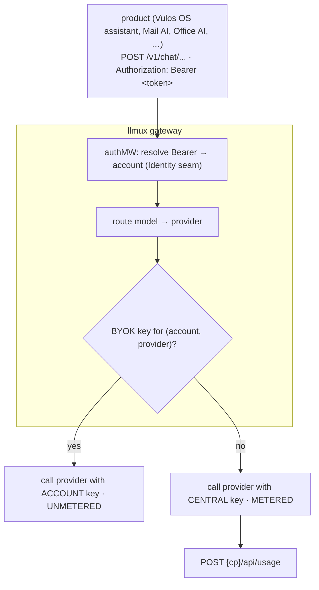

# LLM access: BYOK vs central

llmux is the **central LLM access layer for the Vulos suite**: every product's
LLM features call llmux, and each account chooses how its LLM calls are powered:

- **BYOK** (*bring your own key*) — the account registers its **own provider
  key**. llmux calls the provider directly with that key. These requests are
  **unmetered and never billed** by Vulos.
- **Vulos central** (*default*) — the account uses **our provider keys**. These
  requests are **metered** and (with the control-plane seam wired) **billed**
  like every other Vulos usage dimension.

This is the same open-core seam llmux already uses for the control plane:
standalone llmux works with BYOK and/or local config and **no control plane**;
central billing is an adapter layered on top.



---

## 1. BYOK vs central key resolution (per account)

Resolution is **per `(account, provider)`** and happens at **dispatch time**,
once the requested model has been routed to a concrete provider:

1. The request's Bearer token is resolved to an **account** by the Identity seam
   (static virtual key in standalone mode, or the control plane).
2. The router resolves the model to a provider (e.g. `openai`, `anthropic`).
3. The gateway asks the **BYOK store**: does this account have a key for that
   provider?
   - **Yes** → the account's key is injected into *this call only*
     (`provider.WithAPIKey`); the request is marked **BYOK / unmetered**.
   - **No** → the provider's statically-configured **central** key is used; the
     request is **metered**.

Because BYOK is per provider, a single account can be BYOK for one provider and
central for another. On a fallback chain, resolution is **re-evaluated per
target**, so the right key is always used and the metering decision follows the
provider that actually served the request (an account's OpenAI key is never sent
to Anthropic).

### Default / fallback policy

| Situation | Outcome |
|---|---|
| No KEK configured (BYOK disabled) | **Central** for everything (the standalone default — unchanged behavior). |
| Account has **no** BYOK key for the routed provider | **Central**, metered. |
| Account **has** a BYOK key for the routed provider | **BYOK**, unmetered. |
| Provider is **central-only** (e.g. Bedrock — SigV4, not a single bearer key) | **Central**, even if a key was somehow stored. BYOK is rejected at set time for these. |
| Cache hit | Metering decision attributed to the route's **primary** provider's BYOK status (no provider call is made). |

> **New accounts default to central**, so the free tier and central budget apply
> until the account opts into BYOK.

### Eligible providers

BYOK works for every adapter that authenticates with a **single key**:
`passthrough` (OpenAI, DeepSeek, Groq, Mistral, Together, Fireworks, xAI,
OpenRouter, Ollama, …), `anthropic`, `gemini`, `cohere`, and `azure`.
**Bedrock is central-only**: it uses AWS SigV4 credentials rather than a single
bearer key, so treating it as BYOK would silently use the central AWS
credentials while skipping metering. The gateway therefore refuses to mark
Bedrock requests as BYOK.

---

## 2. Key storage (encrypted at rest)

BYOK keys are stored **encrypted with AES-256-GCM** under an operator-supplied
**key-encryption key (KEK)**:

- The KEK is 32 bytes, supplied raw, as 64-char hex, or base64. **Prefer the
  `LLMUX_BYOK_KEK` environment variable** over the config file.
- On disk (`byok.store_path`) only ciphertext is ever written
  (each value sealed with a fresh random nonce); the in-memory store also holds
  ciphertext so a heap/core dump never exposes plaintext keys.
- Secret values are **never logged** and are **never returned** by any endpoint —
  storage is write-only from the outside; the plaintext is read only on the
  gateway's request path.

Enable BYOK by setting a KEK (and optionally a persistent store path):

```bash
export LLMUX_BYOK_KEK=$(openssl rand -hex 32)   # 64 hex chars = 32 bytes
export LLMUX_BYOK_STORE=/var/lib/llmux/byok.json  # omit for in-memory only
```

or via the config file:

```json
"byok": { "kek_env": "LLMUX_BYOK_KEK", "store_path": "byok.json" }
```

With **no KEK**, BYOK is disabled and every request uses the central keys.

### Endpoints to set / clear BYOK (per provider)

All BYOK management endpoints are **master-key gated** (the `/admin/*` surface).
In the suite the control plane brokers these on an account's behalf.

| Method & path | Body | Effect |
|---|---|---|
| `PUT /admin/byok/{account}/{provider}` | `{"api_key":"sk-…"}` | Store (encrypt) the account's key for a provider → that provider goes BYOK. |
| `DELETE /admin/byok/{account}/{provider}` | — | Remove the key → that provider reverts to central. |
| `GET /admin/byok/{account}` | — | List the provider **names** the account has BYOK keys for. **Never returns key values.** |

```bash
# Make account acct_42 BYOK for OpenAI:
curl -X PUT http://localhost:4000/admin/byok/acct_42/openai \
  -H "Authorization: Bearer $LLMUX_MASTER_KEY" \
  -H "Content-Type: application/json" \
  -d '{"api_key":"sk-the-accounts-own-openai-key"}'

# Revert to central:
curl -X DELETE http://localhost:4000/admin/byok/acct_42/openai \
  -H "Authorization: Bearer $LLMUX_MASTER_KEY"
```

When BYOK is disabled (no KEK) these endpoints return **501 Not Implemented**.

---

## 3. Metering → billing (central path only)

Central requests are metered exactly as before, using the **Usage seam** the rest
of the suite uses. With the [control-plane seam](control-plane.md) wired, each
finalized central request emits:

```
POST {cp}/api/usage
Idempotency-Key: <usage record id>
X-Relay-Auth: <shared secret>

{ "idempotency_key": "...", "product": "llm", "account_id": "...",
  "kind": "llm_tokens", "count": <total tokens>, "cost_usd": <USD> }
```

The CP dedupes by `Idempotency-Key`, so retries (and a future ledger replay) bill
at most once. The existing **budget gate** still bounds central spend, including
during a CP outage (`LLMUX_CP_DEGRADED_RPM` / `LLMUX_CP_DEGRADED_FAIL_OPEN`).

**BYOK requests are never sent to `/api/usage`.** They carry a `byok: true` flag
on the usage record; the CP billing sink drops those, while the local JSONL log
and the dashboard still record them so the account retains visibility into its
own (unbilled) usage.

> **Open-core seam preserved.** Standalone llmux meters to JSONL / the dashboard
> with no CP. The CP usage POST is purely the billing adapter; deleting
> `integration/cp` never breaks the core, and BYOK works with or without a CP.

Interaction with the central budget gate: BYOK usage never decrements the
account's central budget (nothing is POSTed), so a BYOK account simply never
depletes its central allowance through BYOK calls. The gate continues to govern
*central* requests (suspension, `llm_enabled`, remaining budget).

---

## 4. Product consumption contract

Every Vulos LLM feature routes through **one endpoint** on llmux:

```
POST /v1/chat/completions          (OpenAI-compatible; streaming via "stream": true,
Authorization: Bearer <token>       byte-identical OpenAI SSE)
Content-Type: application/json
```

- **Auth / account context:** the `Authorization: Bearer <token>` is resolved to
  an account by llmux's Identity seam (a static virtual key standalone, or the
  control plane in the suite). That account is what BYOK-vs-central and metering
  key off — so **a product does not decide BYOK/central; it just forwards the
  account's token** and llmux applies the right key and metering.
- **Meet captions:** server-side transcription routes through
  `POST /v1/audio/transcriptions` (a `multipart/form-data` audio upload). It is
  gated exactly like every other route (sovereignty, BYOK/central, fail-closed
  metering). Per-audio-minute pricing is not yet wired, so a served
  transcription logs a **$0 auditable** line for unbudgeted/BYOK keys and is
  **refused pre-flight** for a *budgeted* key (no price ⇒ `403 model_not_priced`,
  no upstream spend) — never a silent free path.
- **Shape:** standard OpenAI chat-completions request/response and SSE. Any
  OpenAI SDK (or a raw SSE reader) works unchanged; the `model` string selects
  the route. Embeddings (`/v1/embeddings`) and the forwarded modality routes
  (`/v1/completions`, `/v1/responses`, `/v1/rerank`, `/v1/moderations`,
  `/v1/images/generations`, `/v1/audio/speech`, `/v1/audio/transcriptions`,
  `/v1/audio/translations`) follow the same BYOK/central + metering rules.

### Alignment with the existing `airouter` contract

The mail connector's (`lilmail`) `[ai]` block already targets an OpenAI-compatible
SSE chat endpoint (`/api/ai/chat`, the Vulos OS *airouter*) with a Bearer token. llmux's
`/v1/chat/completions` is the **same OpenAI-compatible SSE shape**, so a product
migrates by pointing its `[ai] endpoint` at llmux and passing the account token
as the Bearer. The airouter can also simply front llmux for the same effect.

> **Follow-up (not in this change):** actually re-pointing each product
> (the Vulos OS assistant, the mail connector's AI, Office AI, …) at llmux and threading the
> account token is product-side wiring. This change delivers the gateway, the
> contract, and this document; per-product wiring is tracked separately.

---

## 5. Free-tier entitlement / budget hook

Central LLM access is part of the **limited free tier** (see the parallel cloud
free-tier work). The hook is already present and intentionally minimal:

- The **budget gate** (`server.BudgetGate`, implemented by `integration/cp`)
  reads the account's entitlement from the control plane
  (`GET {cp}/api/entitlements?product=llm&account_id=…` →
  `{ llm_enabled, llm_budget_usd, suspended }`) and **denies central requests**
  when LLM is disabled, the account is suspended, or the (free-tier) budget is
  exhausted — with an in-flight reservation so concurrent requests can't
  overshoot.
- The free tier is therefore expressed as a **small `llm_budget_usd`** (and/or a
  tier label on the resolved principal) set by the CP. No llmux change is needed
  to enforce a free-tier cap — it flows through the existing entitlement gate.
- **BYOK is the natural "unlimited" lane:** because BYOK requests are unmetered,
  an account that brings its own key is not constrained by the central free-tier
  budget.

To extend the free tier later (e.g. a monthly token grant separate from USD),
add the new dimension to the CP entitlement response; the gate already centralizes
the allow/deny decision, so that is the single place to hook it.

---

## Summary

| | BYOK | Central |
|---|---|---|
| Provider key | Account's own (encrypted at rest) | Vulos central keys |
| Metering | None | `kind: llm_tokens` to `{cp}/api/usage` |
| Billing | Never | Like all suite usage (idempotent) |
| Budget gate | Not consumed | Enforced (incl. free-tier cap) |
| Set via | `PUT /admin/byok/{account}/{provider}` | default (no BYOK key) |
| Standalone | Works with no CP | Meters to JSONL/dashboard with no CP |
