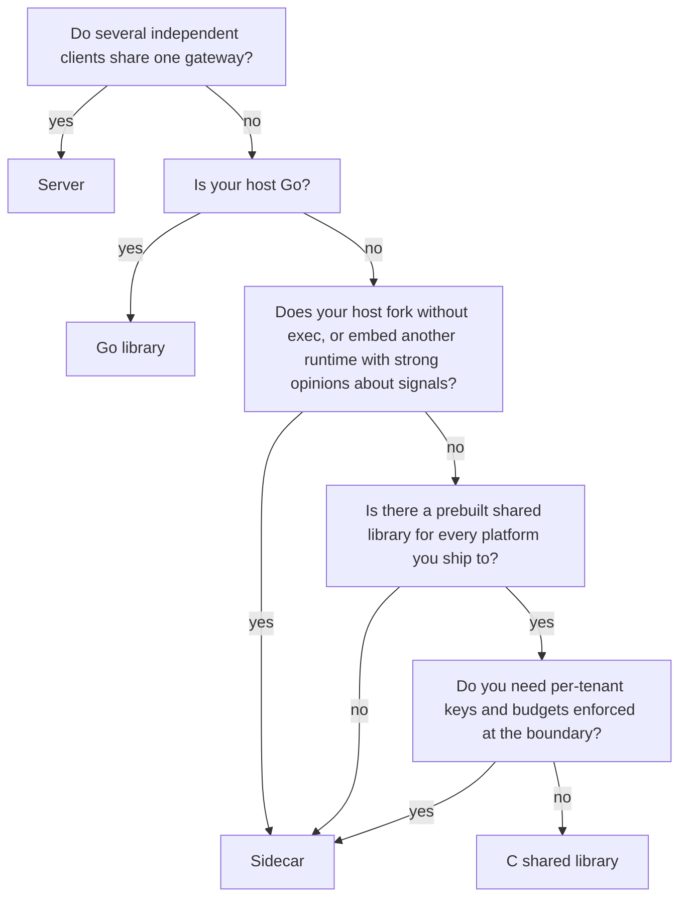

# Choosing a mode

There are four ways to run llmux, and they are not ranked. This page exists so
you pick one on purpose, in about five minutes, rather than discovering the
constraint that rules it out three weeks later.

| Mode | What it is | You get | You pay |
|---|---|---|---|
| **Server** | `llmux serve` on a host or in a container, shared by many clients | Virtual keys, budgets, rate limits, the admin console, one place to change routing for a fleet | A service to run, a port to secure, an HTTP hop |
| **Sidecar** | The same binary, spawned and supervised by a language package on `127.0.0.1:<free port>` | Everything the server has, no server to operate; streaming works natively in every language | A child process per host process, a loopback port |
| **Go library** | `import "github.com/vul-os/llmux/core/gateway"` | No process, no port, no socket; per-request facts (`Result.Provider`, `Result.CacheHit`, `Result.BYOK`) the HTTP shell flattens away | You are inside the trust boundary — auth is yours to call |
| **C shared library** | `dlopen` `libllmux.dylib` / `.so` from any language | The Go library's benefits from a non-Go host | The Go runtime in your process, ~12–17 MB, no fork-safety, and a platform matrix with real gaps |

## Start here

Two of those five questions rule the C shared library out, and that is the
honest shape of the decision. Choosing the sidecar is a supported outcome of
reading this page, not a failure.

## The reason people pick in-process is usually the wrong one

Latency is measured, not asserted. `ffi/bench` dlopens the real shared library
and drives it from the same Go program that drives an `llmux serve` HTTP handler
over loopback, against the same fake upstream, so the difference is the
transport and nothing else. darwin/arm64, 1000 measured requests each, Go
1.25.12, llmux 0.1.2, median of three runs:

| workload | in-process (C ABI) | loopback HTTP | saved |
|---|---|---|---|
| `models` — answered from memory, no upstream | **~4.0 µs** | ~46–49 µs | ~43 µs |
| `chat` — includes the upstream round trip | ~80–92 µs | ~102–109 µs | ~10–28 µs |

The `models` row is the boundary itself: a cgo call plus JSON in and JSON out,
against a loopback TCP round trip plus HTTP framing. The `chat` row is that same
saving inside a request that actually does something — both rows include an
identical upstream call, so the delta is the same delta, diluted.

**Against a real model both rows are noise.** A real completion takes hundreds
of milliseconds to tens of seconds. Saving 40 µs of transport is a rounding
error on that. The loopback HTTP figures above are measured with keep-alive on,
i.e. the sidecar at its best.

So what is in-process actually for? No second process to supervise, no port to
bind, no loopback surface to secure, no request bodies crossing a socket, and
per-request state the HTTP shell has no field for. Latency is the least of it.

## Where authentication lives

This is the difference most likely to bite you, because both boundaries look the
same from the outside and only one of them checks anything by default.

- **Server and sidecar.** `core/server`'s auth middleware runs on every request:
  virtual keys, per-key budgets, per-key model allow-lists, rate limits. A
  network client cannot skip it.
- **Go library.** There is no middleware, because there is no HTTP. The same
  check is available as one call — `gw.Authorize(ctx, token)` — and it is the
  *same function* the HTTP middleware calls, so an embedder cannot get a laxer
  check than a network client. But you have to call it. See
  [Embedding llmux](embedding.md#authorization-is-one-call-and-you-must-make-it).
- **C shared library.** There is no authentication on that boundary, by design,
  and no `Authorize` exposed across it. An in-process host is already inside the
  trust boundary. **If you need per-tenant keys and budgets enforced at the
  boundary, that is the sidecar's job** — do not build a multi-tenant service on
  top of the C ABI and expect llmux to be the thing stopping tenant A from
  spending tenant B's budget.

## Does it ship where you ship?

The server and the sidecar run wherever the Go binary runs, which is everywhere
Go cross-compiles to — no cgo, no toolchain. The C shared library does not, and
the gap is not theoretical:

| target | shared library status |
|---|---|
| darwin/arm64 | Built and tested on the development machine |
| linux/arm64 | Built and tested in a `golang:1.25` container |
| linux/amd64 | Built and tested **in CI only** — not produced on the development machine |
| windows/amd64 | **Does not exist.** No `.dll` has been produced by anyone yet |
| darwin/amd64 | **Does not exist.** No Intel macOS machine or SDK here |

If you ship to Windows or to Intel Macs, the C ABI is not currently an option
for those targets and nobody should tell you otherwise. Full detail, including
what a cross toolchain would take, is in [The C ABI](c-abi.md#where-it-runs).

## What each mode costs in bytes

Measured in this checkout (darwin/arm64, go1.25.12):

- A program importing only `core/gateway`: **15,293,346 bytes**. It links
  **zero console bytes** — only `core/server` imports `web/`, so the embedded
  `ui.html` is not in a library host regardless of build tags.
- Adding `core/server` with the console: **17,114,706 bytes** (+1,821,360 for
  the HTTP shell and the console together).
- The `cmd/llmux` binary: **17,949,410 bytes**, or **17,916,098** with
  `-tags noui` — a **33,312-byte** difference, which is exactly `web/ui.html`
  (21,509 bytes) plus `web/THIRD-PARTY-NOTICES-GO.txt` (15,142 bytes).
- The C shared library: ~12 MB on darwin/arm64, ~17 MB on linux/arm64. Most of
  that is the Go runtime, and you get a second one if your process already loads
  another Go-built `c-shared` library.

`noui` is worth having and is not a size strategy: 33 KB out of 18 MB. The real
size lever is not importing the HTTP shell at all.

## Mixing modes

They compose, and doing so is normal:

- Embed the Go library in your application **and** run a shared server for
  everything else. Two `*Gateway` values in one process never interfere —
  there is no package-level mutable state and no package logger.
- Run the sidecar in development (fast to reason about, one `/health` to poll)
  and switch the same code to a shared server in production by changing a
  `base_url`. Nothing else changes, because the wire is the OpenAI HTTP API
  either way.
- Use the Go library for your own dispatch and still run `core/server` in the
  same process when you want the console or `/metrics`. `core/server` is a
  shell over the library, not an alternative to it.

## Related

- [Embedding llmux](embedding.md) — the `core/gateway` API in full, and the two things `New` does on its own
- [The C ABI](c-abi.md) — the six functions, the ownership rules, and the costs
- [Language packages](sdks.md) — what ships per language and which mechanism it uses
- [Quickstarts](quickstarts.md) — five-minute paths for each audience
- [Architecture](architecture.md) — how the gateway is laid out
