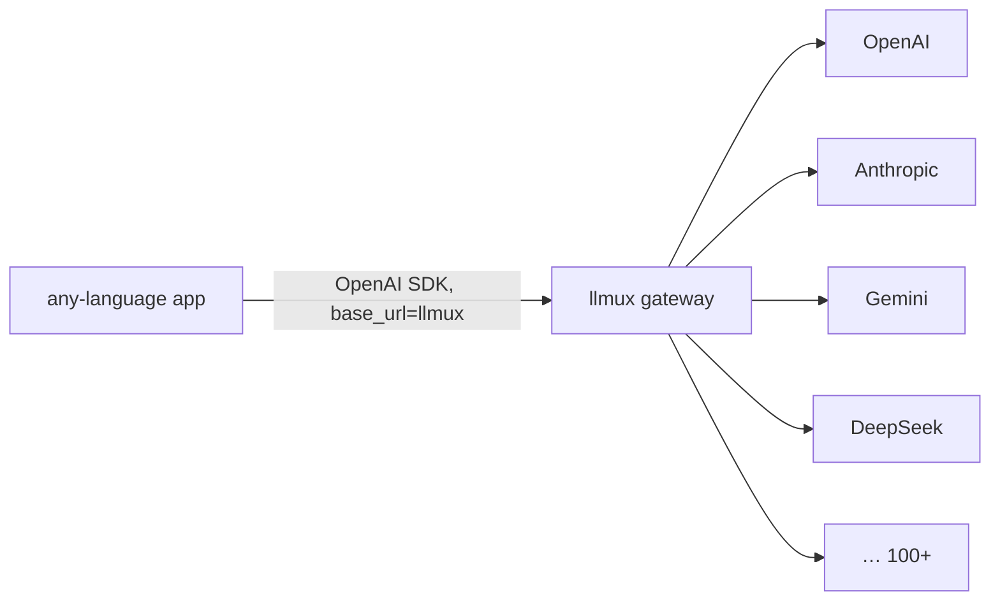

# llmux — Roadmap

> The LLM multiplexer. One gateway, every provider, **every language**.
> OSS core (self-host free, forever) + `ee/` for hosted **llmux Cloud**.
> Home: `llmux.to`

---

## 0. The core idea: how we get "every language" for free

The hard part of LiteLLM is that it's **library-first** (a Python SDK). That
structurally traps it in Python — every other language needs a port nobody
maintains.

llmux does the opposite. It is a **single Go binary that speaks the
OpenAI-compatible HTTP API** (REST + SSE streaming). This solves "all languages"
*structurally, on day one, with zero per-language code*:

- Every language already ships a mature, maintained OpenAI client
  (`openai-python`, `openai-node`, `openai-go`, Java, Rust, PHP, Ruby, .NET, …).
- Every one of them accepts a custom `base_url`.
- So a Go dev, a Python dev, and a Rust dev all just point their **existing**
  client at `https://llmux.to/v1` (or their self-hosted instance) — and get
  every provider, routing, fallbacks, budgets, and caching underneath.



**We write the gateway once; the language ecosystems already wrote the clients.**

Optional later: thin native SDKs (`llmux-py`, `llmux-js`, …) for ergonomics —
auth helpers, typed routing hints. They are **sugar, not required**. The HTTP
contract is the product.

### Design rules that keep "any language" true
1. The OpenAI HTTP schema is the **canonical interface**. Providers are adapters
   behind it, never leaked to the client.
2. Anything a client needs (routing, fallback, budget tags) is expressed via
   **standard fields + `extra_headers` / `metadata`** — so any OpenAI SDK can
   send it without a custom client.
3. SSE streaming wire-format matches OpenAI exactly (`data: {...}\n\n`,
   `[DONE]`) so every language's streaming parser just works.

---

## 1. Architecture

```
llmux/
  core/         # MIT — gateway, providers, routing, BYO-keys, pricing sync
    server/     # HTTP server: /v1/chat/completions, /v1/embeddings, /v1/models
    providers/  # adapters: passthrough/, anthropic/, gemini/, bedrock/, cohere/
    router/     # alias, fallback, retry, load-balance, least-cost/least-latency
    pricing/    # catalog sync (OpenRouter + LiteLLM JSON), cost calc
    keys/       # virtual keys, budgets, rate limits
    cache/      # exact + semantic response cache
    store/      # Postgres + optional Redis
  ee/           # MIT (hosted Cloud is the monetization) — SSO/SAML, RBAC, audit, multi-tenant admin
  cloud/        # hosted llmux Cloud (uses core + ee)
  sdks/         # OPTIONAL thin native SDKs (py, js, go) — ergonomics only
  docs/         # docs site (llmux.to)
```

- **Stateless core** → scale horizontally behind a load balancer.
- **State** (keys, budgets, logs, cache) in **Postgres + optional Redis**.
- A build flag includes/excludes `ee/`. Self-hosters run `core/` free forever.

---

## 2. Provider strategy (effort-ordered)

**Tier A — pass-through (≈80% of providers for nearly free).**
Already OpenAI-shaped: just route + swap key/base-URL, minimal translation.
> OpenAI, Azure OpenAI, DeepSeek, Mistral, Groq, Together, Fireworks, xAI,
> OpenRouter, Ollama / vLLM / LM Studio.

**Tier B — real adapters (request/response + streaming + tool-call translation).**
> Anthropic (use its OpenAI-compat endpoint where possible), Google Gemini,
> AWS Bedrock, Cohere.

**Normalization layer (cross-cutting):** streaming, tool/function calling,
vision/multimodal, embeddings → one unified shape.

**MVP provider set:** OpenAI + Anthropic + Gemini + DeepSeek + OpenRouter
(as universal fallback).

---

## 3. Pricing — free, and *more live* than LiteLLM

LiteLLM's "free pricing" is a maintained open JSON
(`model_prices_and_context_window.json`): per-model input/output cost, context
window, max output, capability flags. MIT-licensed, but **PR-driven → lags**
when providers change prices.

llmux does it **auto-synced from live feeds** (this is a differentiator):
1. **OpenRouter `/models`** — free public endpoint, live per-token pricing +
   context for 300+ models. **Primary source.**
2. **LiteLLM's open JSON** — merge in for models OpenRouter misses (MIT,
   attributed).
3. **Provider pricing APIs** where exposed (Azure / Bedrock); OpenAI / Anthropic
   via docs.
4. **Merge → llmux catalog** with manual overrides; sync hourly/daily via cron.

Then **publish llmux's merged catalog as its own open JSON + a free `/v1/models`
endpoint** → community uses & contributes back; fresher than LiteLLM because it's
auto-synced, not PR-gated. Every response returns **cost in its `usage` block**.

---

## 4. "Free at scale" — the business model

**Open-core**, same pattern as LiteLLM / Supabase / GitLab:

- **Self-host (`core/`)**: free forever. No per-request fee. You pay only your
  infra + your own provider tokens (**BYO keys**). Go = no GIL, low memory, high
  throughput → cheaper per request than Python LiteLLM. Runs on a $5 VM.
- **llmux Cloud (`ee/` + `cloud/`)**: managed, monetized via flat platform fee
  and/or enterprise tier (SSO, audit, SLA, RBAC).

**How Cloud undercuts OpenRouter** (OpenRouter takes ~5–5.5% per token):
1. **Flat platform fee** (or free on OSS) instead of a per-token cut — biggest
   lever; OpenRouter structurally can't.
2. **Thinner managed margin** (~2–3% vs ~5%) when we do resell tokens —
   sustainable because Go opex is low.
3. **Volume / committed-use discounts** aggregated across Cloud usage, partly
   passed through.
4. **Exact + semantic caching** cuts real provider calls → effective price below
   OpenRouter, which doesn't cache your traffic.

Net pitch: *self-host free with your keys; or llmux Cloud — your keys + flat fee,
or resold tokens at ~half OpenRouter's margin, caching on top. The live catalog
makes the savings visible per model.*

---

## 5. Phases

| Phase | Theme | Ships |
|------|-------|-------|
| **P1** | Core gateway | OpenAI-compat `/v1/chat/completions` (+stream), provider registry, Tier-A pass-through, config loading |
| **P2** | Adapters | Anthropic + Gemini adapters, tool/vision normalization, `/v1/embeddings`, `/v1/models` |
| **P3** | Gateway features | Virtual keys, budgets, rate limits, fallbacks/retries, routing (alias/least-cost/least-latency), caching |
| **P4** | Pricing + usage | Price-catalog sync, open published catalog, cost in responses, usage logging/export |
| **P5** | Ops + scale | Postgres/Redis, horizontal scaling, metrics/observability, Docker/Helm |
| **P6** | Polish | Admin UI, optional thin native SDKs, docs site (llmux.to), `ee/` cloud features |

**MVP = P1 + P2 + cost logging from P4.** Already useful and covers most traffic.

---

## 6. Non-negotiables
- OpenAI HTTP compatibility is sacred — never break the client contract.
- `core/` stays free and self-hostable forever.
- No provider detail leaks past the gateway boundary.
- Pricing catalog stays open and auto-synced.
